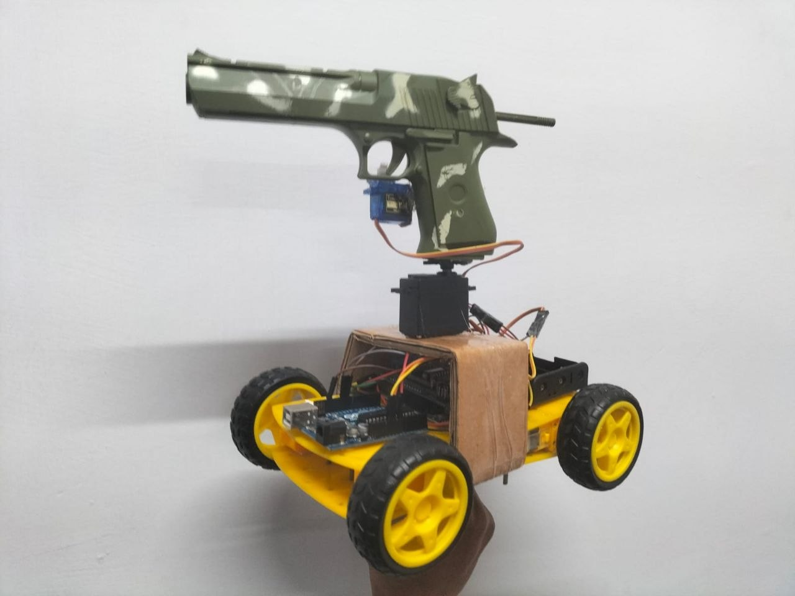
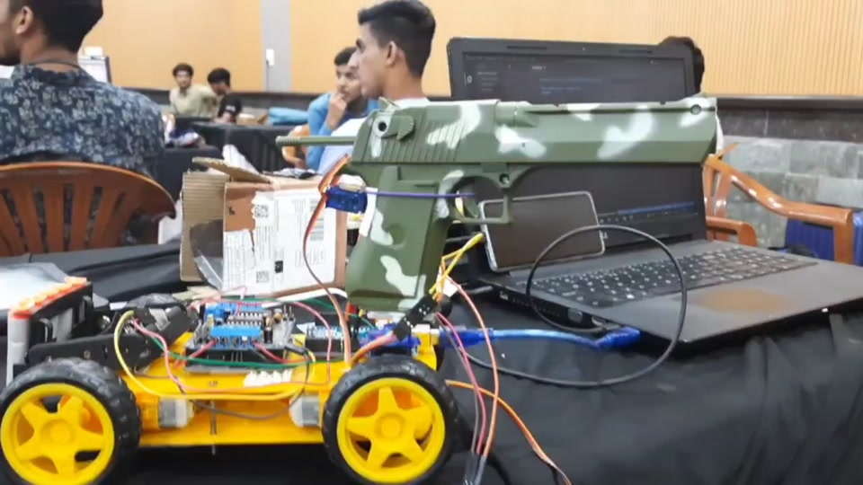

<div align="center">

# Vision-Guided Surveillance Rover

**A computer-vision robotics prototype that detects a human pose, estimates the horizontal torso position and commands an Arduino pan servo in real time.**

[](https://www.python.org/)
[](https://opencv.org/)
[](https://ai.google.dev/edge/mediapipe)
[](https://www.arduino.cc/)
[](https://github.com/sahilsharma20/Remote-Controlled-Surveillance-Vehicle/actions/workflows/ci.yml)
[](LICENSE)



*Physical prototype with a four-wheel chassis, Arduino electronics and a pan-mounted non-functional demonstration prop.*

</div>

---

## Overview

The project combines **computer vision**, **pose estimation**, **embedded control** and **robotics prototyping**. A camera frame is processed using OpenCV and MediaPipe Pose. The midpoint between the detected shoulders becomes the horizontal tracking target. That position is mapped into a bounded servo-angle range and transmitted to an Arduino through pySerial.

The current repository intentionally focuses on the strongest completed engineering path: **camera → pose estimation → target coordinate → safe servo command**. Wheel-drive networking and autonomous navigation are not represented as finished features.

## Demo

<div align="center">

[](assets/demo.mp4)

**Click the preview to open the complete demonstration video.**


</div>

## Why this repository stands out

- Real-time human pose tracking with MediaPipe.
- OpenCV-based camera acquisition and visual debugging overlays.
- Cross-platform Arduino serial communication through pySerial.
- Configurable camera, serial port, frame size, servo limits and update rate.
- Hardware-free `--dry-run` mode for demonstrations and debugging.
- Modular package structure instead of one monolithic script.
- Unit-tested coordinate mapping and visibility-aware landmark handling.
- GitHub Actions workflow for linting and core tests.
- Hardware, architecture, troubleshooting and interview documentation.

## System flow


A deeper explanation is available in [System Architecture](docs/ARCHITECTURE.md).

## Technology stack

| Area | Technology |
|---|---|
| Programming | Python, Arduino C++ |
| Vision | OpenCV |
| Pose estimation | MediaPipe Pose |
| Numerical processing | NumPy |
| Hardware communication | pySerial |
| Embedded controller | Arduino-compatible board |
| Quality | pytest, Ruff, GitHub Actions |

## Repository structure

```text
.
├── .github/                 # CI, issue and pull-request templates
├── arduino/                 # Servo-controller firmware
├── assets/                  # Prototype image, MP4 demo and GIF preview
├── docs/                    # Architecture, setup, troubleshooting and interview notes
├── legacy/                  # Preserved proof-of-concept implementation
├── src/surveillance_vehicle/
│   ├── cli.py               # Command-line interface
│   ├── controller.py        # Real-time tracking loop
│   ├── geometry.py          # Tested coordinate and angle calculations
│   └── serial_io.py         # Arduino serial communication
├── tests/                   # Unit tests for pure control logic
├── main.py                  # Convenience entry point
├── pyproject.toml           # Package and tooling configuration
└── README.md
```

## Quick start

### 1. Clone and create an environment

```bash
git clone https://github.com/sahilsharma20/Remote-Controlled-Surveillance-Vehicle.git
cd Remote-Controlled-Surveillance-Vehicle

python -m venv .venv
source .venv/bin/activate        # Windows: .venv\Scripts\activate
python -m pip install --upgrade pip
python -m pip install -e .
```

MediaPipe's Python setup currently supports Python 3.9 or later on supported 64-bit desktop platforms. Python 3.10–3.12 remains a practical choice for hardware projects with third-party packages.

### 2. Validate the camera pipeline without hardware

```bash
surveillance-vehicle --dry-run
```

Move horizontally in front of the camera. The preview displays pose landmarks, a person box, the torso target and the calculated pan angle.

### 3. Upload Arduino firmware

Open [servo_controller.ino](arduino/servo_controller/servo_controller.ino), confirm the servo pin and upload it using Arduino IDE.

### 4. Find the serial port

```bash
surveillance-vehicle --list-ports
```

### 5. Run in hardware mode

```bash
# macOS example
surveillance-vehicle --serial-port /dev/cu.usbmodem101

# Windows example
surveillance-vehicle --serial-port COM3

# Linux example
surveillance-vehicle --serial-port /dev/ttyACM0
```

Press **q** or **Esc** to stop. The application closes the camera and serial connection cleanly.

## Useful configuration examples

```bash
# Protect a mount with narrower travel limits
surveillance-vehicle \
  --serial-port /dev/cu.usbmodem101 \
  --servo-min 65 \
  --servo-max 155

# Reduce servo updates when movement is jittery
surveillance-vehicle \
  --serial-port /dev/cu.usbmodem101 \
  --update-interval 0.50

# Reverse the movement direction
surveillance-vehicle \
  --serial-port /dev/cu.usbmodem101 \
  --no-invert

# Use another camera
surveillance-vehicle --dry-run --camera 1
```

## How the tracking algorithm works

1. **Capture:** OpenCV reads and resizes each camera frame.
2. **Infer:** MediaPipe Pose predicts normalized body landmarks.
3. **Filter:** Low-visibility landmarks are ignored for the bounding box.
4. **Target:** The midpoint of the left and right shoulders estimates torso centre.
5. **Map:** Horizontal target position is linearly mapped into configurable servo limits.
6. **Protect:** Input and output values are clamped, updates are rate-limited, and duplicate commands are skipped.
7. **Actuate:** pySerial sends a newline-terminated angle to the Arduino firmware.

## Engineering improvements over the initial prototype

| Initial proof of concept | Maintained implementation |
|---|---|
| Hard-coded macOS serial path | CLI-configurable port plus port discovery |
| Single script | Modular perception, geometry and serial layers |
| One shoulder plus fixed pixel offset | Midpoint of both visible shoulders |
| Broad `except` block | Explicit checks and actionable errors |
| Serial connection opened at import time | Context-managed hardware lifecycle |
| No hardware-independent execution | Complete dry-run mode |
| Untested mapping logic | Unit tests and CI |
| Minimal README | Reproducible setup and technical documentation |

## Recognition

The physical prototype was built and demonstrated for the **IEEE CIS Hackathon at MNIT Jaipur (2023)**. Team Visioneers reached the finalist stage, placed **5th overall**, and received a consolation recognition.

## Limitations

- Single-camera, two-dimensional horizontal tracking.
- No depth or distance estimation.
- Best results require a visible upper body and reasonable lighting.
- The current software controls the pan servo; wheel-drive control is not included.
- Servo behaviour still depends on mechanical alignment, power quality and load.
- Qualitative prototype results are shown; production benchmarks are not claimed.

## Roadmap

- [ ] Add exponential smoothing and a configurable deadband.
- [ ] Add pan-tilt support with a second servo.
- [ ] Add multi-person target selection and persistent IDs.
- [ ] Add a lightweight web dashboard with telemetry and manual override.
- [ ] Add optional object detection alongside pose tracking.
- [ ] Package perception and actuator components as ROS 2 nodes.
- [ ] Add hardware-in-the-loop validation.

## Safety and responsible use

This repository is an **educational robotics and computer-vision prototype**. The object mounted in the supplied project media is a **non-functional demonstration prop**. The project is not intended for weaponization, targeting people, invasive surveillance or any harmful use.

When working with physical hardware:

- Test the servo without a load first.
- Use conservative mechanical limits.
- Power motors and servos from an appropriate supply.
- Keep an accessible emergency power disconnect.
- Do not operate moving mechanisms near people or animals.

## Documentation

- [System architecture](docs/ARCHITECTURE.md)
- [Hardware setup](docs/HARDWARE_SETUP.md)
- [Troubleshooting](docs/TROUBLESHOOTING.md)
- [Recruiter and interview walkthrough](docs/PROJECT_WALKTHROUGH.md)
- [GitHub repository setup](docs/REPOSITORY_SETUP.md)

## Contributing

Read [CONTRIBUTING.md](CONTRIBUTING.md) before opening a pull request. Contributions must preserve hardware safeguards and responsible-use boundaries.

## Author

**Sahil Sharma**  
Computer Science Engineer focused on AI/ML, computer vision, data science and practical robotics.

## License

Released under the [MIT License](LICENSE).
